# RFM3 | Location of IPFS end users and requested content.

## Table of Contents

1. [Motivation](#motivation)
2. [Summary of Findings](#summary-of-findings)
3. [Measurement Methodology & Architecture](#measurement-methodology--architecture)
    - [Step 1. Parse data](#step-1-parse-data)
    - [Step 2. Find Providers](#step-2-find-providers)
    - [Step 3. Visualize Data](#step-3-visualize-data)
4. [Results](#results-2)
    - [Requests](#requests)
    - [Providers](#providers)
    - [Requested Content vs. Provided Content](#requested-content-vs-provided-content)
5. [Conclusion](#conclusion)


## Motivation

The topology of structured overlay networks such as DHTs, follow rules that enable routing among the nodes that constitute the network. In DHTs, each node is attributed a random bit string identifier that is comparable according to some distance system. This results in situations where nodes that share similar properties, such as belonging to the same geographical region, to not be placed close at the DHT level. Multi-level DHT designs aim at grouping nodes that share pre-defined properties in the DHT to improve the performance of routing among nodes that share those properties.

The IPFS network leverages a DHT to share content among nodes in the network. In this network we can define nodes that provide content as *providers*, and clients that request content as *requesters*.

The aim of this measurement project is to find if there is locality of interest in the IPFS network (i.e., if requesters request content provided by providers that are in the same geographic region). The goal of this measurement is to understand if and when the IPFS network will benefit from a Multi-level DHT design, and to guide the design of future solutions.

## Summary of Findings

In order to achieve the goal of the project we collected the logs of one of the most popular IPFS gateways — [ipfs.io](http://ipfs.io). These logs contained HTTP requests made by external clients to content stored in the IPFS network. With this log, we extracted the requested CIDs (i.e., IPFS content identifiers) and the geo-location of requesters. We then performed our own requests to the IPFS network requesting the providers of the CIDs found in the gateway logs and stored the geo-location of the providers. With this data it was possible to get the geo-locality of requested content in the IPFS network.

In more detail, the [ipfs.io](http://ipfs.io) logs contained a bit more than 58 million HTTP valid requests that requested a bit more than 4 million different CIDs (there were multiple requests to the same CIDs). We tried to fetch the providers for each of the 4 million CIDs, however we only managed to find providers for around 45% of all CIDs. In total, we found a bit more than 55 thousand different providers. Nevertheless, some of the provider records we found lacked addressing information (i.e., the provider record had peer ids with no associated multi-address), which made it impossible to extract geo-location information. As such, we only considered for this study the providers that had addressing information, which amounts to about 48% of providers found.

In our analysis we study multiple aspects related to how content is distributed among providers and how requests are distributed across different content. In particular, we found that requests to content follow a Zipf distribution; meaning that in the IPFS network there are a select few CIDs that are highly popular (i.e., are requested a lot of times) and there are a large number of CIDs that are not popular at all, being requested only a single time. Furthermore, and interestingly, we found that the popular CIDs are not the CIDs that have higher numbers of providers. In fact, the most popular CIDs have less than 10 providers. However, we found very interesting outliers to this. In particular there was a very popular CID that had much more providers than the remaining popular CIDs. We found that this CID had a different nature from the rest.

Finally, we analysed the relation between the geo-location of the origin of requests and the geo-location of providers, and found that there is very little relation. For example, only 5.24% of all requests originating from Asia actually have providers in Asia, while 30.32% and 48.41% of all requests originating from Asia have providers in Europe and North America, respectively. This is due to most content and providers being located in Europe and North America.

We have written a paper detailing our study. You can find a pre-print version of the paper here: [https://arxiv.org/abs/2212.07375](https://arxiv.org/abs/2212.07375).

In the following we provide more details on how we reached these conclusions and provide further insights.

## Measurement Methodology & Architecture

Figure 1 represents our measurement architecture. Our main component is the controller component that coordinates the whole process of processing the gateway logs, requesting to find the providers, and finally populating a database with relevant information. The controller feeds the gateway logs through a message broker, in our case a simple rabbitMQ instance. After this, the controller requests the Parser component to parse a log entry into a structured data format such as JSON. From the parsed data, the controller requests the Find Providers component to query the IPFS DHT for the providers of the requested CID. With the providers returned, the controller requests again from the parser to get geo-location information from the IP address of the providers found. The controller writes the data processed to a database component, in our case a postgres database, that support a dashboard (grafana) to visualize the data.

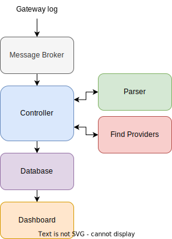

Figure 1. Measurement architecture.

The architecture presented in Figure 1 is prepared for continuous monitoring. We also used tools for offline processing. In fact, we divided the process of parsing the HTTP requests from the fetching of provider records (i.e., we only fetched the providers once all HTTP requests have been parsed). This allowed us to be more effective in fetching the provider records since we could fetch the providers for all CIDs only once. Furthermore, we also used python scripts to create the plots presented in this report.


In the following we provide some more details on the steps used to obtain the locality of request in the IPFS network.

### Step 1.  Parse data

The first step is to parse the log entries from the IPFS gateways. The logs are provided by a nginx server in the following format:

```jsx
199.83.232.50 - - [2022-03-21T00:00:58+00:00] "GET /ipfs/QmPvt7yHLGpVhd4jVFX6reEZZ34fQRepQ1a1QTsZQBH1hJ/KittyCat3621.png HTTP/1.1" 200 50470 120 12.823 12.820 12.820 MISS "-" "-" *.i.ipfs.io ipfs.io https
<ip> <x> <y> <time> <request> <status> <body_bytes> <req_lenght> <request_time> <upstream_response_time> <upstream_header_time> <upstream_cache_status> <http_refer> <http_user_agent> <server_name> <http_host> <scheme>
```

Each log entry is passed directly to the Parser component. The Parser is implemented as a python REST web service with 2 endpoints:

- `/parse` - receives the log entry and returns the log entry in JSON format along with the requested CID, and the geo-location data associated to the IP address of the requester.
- `/locate_providers` - receives a JSON with providers IP addresses and fetches the geo-location data on each IP address.

Parsing is done with the help of regex expressions where each field is put in a variable, more details on how to do this can be found [here](https://www.notion.so/Methodology-0d816b5a84a7426c9f80f341d1a29d66). After parsing is done, the Parser checks if the HTTP status of the request is a valid one. In this context, valid means that the HTTP status is either a 200 or a 300 code. Either of these statuses indicate either the content was locally cached on the gateway or a request to the IPFS network was performed and the content was found. We do not consider requests with status code of 400, as, although a request to the IPFS network might have been performed, the content was not found, which indicated that the content was either never or no longer available on IPFS, and thus with high probability will not have a provider record on the DHT.

The geo-location data is provided by the [MaxMind GeoLite2 database](https://dev.maxmind.com/geoip/geolite2-free-geolocation-data?lang=en), which might not have an entry for the requested IP address. In this case, it is returned a Null value for geo-location fields.

#### Results

The total gateway logs dataset had 123,959,912 total HTTP requests that spanned over the course of 2 weeks. The following table summarises the breakdown of the dataset. 2,165 (0.001%) of these were out of format and thus discarded. 24,298,396 (19.602%) were HTTP operations other than GET operations that did not represent a request to the IPFS network (illustrated as "Not GETs" in the table). This left 82,439,744 (80.396%) HTTP requests that were GET operations (illustrated as "All GETs"). Out of these, only 58,869,788 were considered Valid GETs (had an HTTP status of 200 or 300, and had a CID). This represents 47.5% of the total gateway dataset. In these HTTP requests, 4,009,575 different CIDs were requested, which we used in the next step of our study.

|  | Number of entries | Percentage |
| --- | --- | --- |
| Total HTTP requests | 123, 959, 912 | 100% |
| Out of format | 2, 165 | 0.001% |
| Not GETs | 24, 298, 396 | 19.602% |
| All GETs | 82, 439, 744 | 80.396% |
| Valid GETs | 58, 869, 788 | 47.491% |

### Step 2. Find Providers

The next step is to find the providers of the requested CID. To do this, the controller requests the Find Providers component to search the IPFS DHT for the providers of the CID. The Find Providers component is a Golang REST web service with 1 endpoint:

- `/findProviders/{cid}` - queries the IPFS DHT for a given CID returning the providers, if any.

To query the IPFS DHT, the Find Providers component uses the DHT component of go-libp2p that by default connects to the IPFS DHT. With this, the Find Providers component becomes very simple, performing only a few API calls to libp2p. By default the libp2p API call tries to find at most 20 providers for a given CID. We however, perform this API call to perform an exhaustive search for all provider records of any given CID.

Note however, that the process of finding providers can take some time (from seconds to minutes, depending on the CID). This means that the process of finding providers may require fine tuning on the amount of parallelism (i.e., amount of queries for CIDs in parallel) and some processing power to keep up with the rate of requests.

Once the providers are returned to the controller, the controller requests the Parser component to fetch the geo-location of the providers.

For a fixed gateway dataset (i.e., gateway logs are not being continuously produced and consumed), the most optimal way of processing this, is to first populate the database with all requests and then find the providers of all unique CIDs. This way, there will be less requests being made, lowering the burden on the network infrastructure. We provide scripts and services for this purpose in our repository.

#### Results

From the total unique CID dataset we gathered from the previous step (4,009,575 unique CIDs), we were only able to find providers for 1,833,967 CIDs, with a total of 55,830 different providers found. Out of these providers, about 59% of them did not have any multi-address associated to it. In this case, we queried once again the IPFS DHT to find the peers without multi-address. With this, we were able to find 26,886 peers with multi-address information (including the ones already found with the provider records). The following table summarises this data.

|  | Number of entries | Percentage |
| --- | --- | --- |
| Total CIDs | 4, 009, 575 | 100% |
| CIDs w/out Providers | 2, 175, 608 | 54.26% |
| CIDs w/ Providers | 1, 833, 967 | 45.74% |
| Total Providers | 55, 830 | 100% |
| Providers w/out address | 32, 968 | 59% |
| Providers w/ address | 22, 862 | 41% |
| Providers w/ address after find | 26, 886 | 48% |

### Step 3. Visualize data

The final step is to visualize the data. To this end, the data (of requests and providers) is stored in a database with the following schema:

```sql
Create TABLE requests (
                          req_id bytea primary key, --- an hash id of the request
                          timestamp TIMESTAMP not null, --- the timestamp of the request
                          cid VARCHAR(100) not null, --- the requested cid
                          continent char(2), --- the continent code of the requester
                          country char(2), --- the country code of the requester
                          region varchar(5), --- the region code of the requester
                          lat float, --- the latitude of the requester
                          long float, --- the longitude of the requester
                          asn int, --- the Autonomous System Number of the requester
                          aso text, --- the Autonomous System Organization of the requester
                          request_time float, --- the amount of time the request took to process
                          upstream_time float, --- the amount of time it took for the upstream server to respond. The upstream server here is assumed to be an IPFS client process.
                          body_bytes bigint, --- the amount of bytes returned after the request
                          user_agent text, --- the user agent used by the requester
                          cache text, --- a cache status on the requested content on the nginx server													
);

Create TABLE providers (
                           cid VARCHAR(100) not null, --- the cid provided
                           continent char(2), --- the continent code of the provider
                           country char(2), --- the country code of the provider
                           region varchar(5), --- the region code of the provider
                           lat float, --- the latitude of the provider
                           long float, --- the longitude of the provider
                           asn int, --- the Autonomous System Number of the provider
                           aso text, --- the Autonomous System Organization of the provider
                           request_time float, --- the amount of time it took to find this provider
                           peerID varchar(100), --- the PeerID of the provider
                           found_at timestamp, --- a timestamp of when the provider was first found
                           updated_at timestamp, --- a timestamp of when the provider was last seen
                           primary key (cid, peerID)
);
```

This schema treats the requests data as time-series data, to enable visualisation of the data evolving over time. The providers data is formatted more as tabular data, since providers of a content do not change with high frequency. This further allows optimisations to be made in the controller component, avoiding the request for finding providers of content that have been found recently.

With this data, we can answer not only the question this study aims *“Is there geo-locality of interest in the IPFS network?”*, but also adjacent questions such as:

- *“How many requests are made to IPFS through the gateway on average per day ?”*
- *“What is the popularity of different CIDs in the system ?”*
- *“How are providers geo-distributed in the system ?”*
- *“How is provided content distributed across providers in the system ?”*

We analyse the geo-location data with the granularity of continents, with the following encoding:

| Africa | AF |
| --- | --- |
| Asia | AS |
| Europe | EU |
| North America | NA |
| Oceania | OC |
| South America | SA |
| Antartica | AN |

In the following section we present the results to answer each question.

## Results

We divide this section in three parts:

1.  **Requests:** First, we analyse the data related only to the requests made to the gateway. Our first analysis on this data looks into the performance of the gateway. In particular, we analyse how many requests does the gateway process, on average, that succeed in retrieving the content to the user; and how much time it takes for the gateway to process these requests, given the content size as well as where it is provided geographically. We also analyse the frequency of requested CIDs, to understand the popularity distribution of content requested through the gateway.
2. **Providers:** Second, we analyse the data related only to the providers of content requested through the gateway. With this, we aim to show how are providers of content firstly geo-distributed and secondly, analyse how is content distributed over the providers.
3. **Requested content vs. Provided content:** Finally, we analyse the requests and provider data to understand how the two relate and answer the question of this study:  *“Is there geo-locality of interest in the IPFS network?”*

### Requests

We begin by analysing the data we gathered by the IPFS gateway. First we analyse how many requests are processed successfully by the gateway. This can be seen in Figures 2 and 3, that show the successful requests over the observed period of the 7th of March of 2022 to the 22nd of March of 2022. We note that on the 14th of March the number of requests to the gateway drops significantly, recovering after a few hours. We noticed that indeed there is a gap in the logs for this day, whose most likely cause is that the gateway was unavailable during that period.

Furthermore, we can see that requests are steady with an average of over 150, 000 requests per hour.

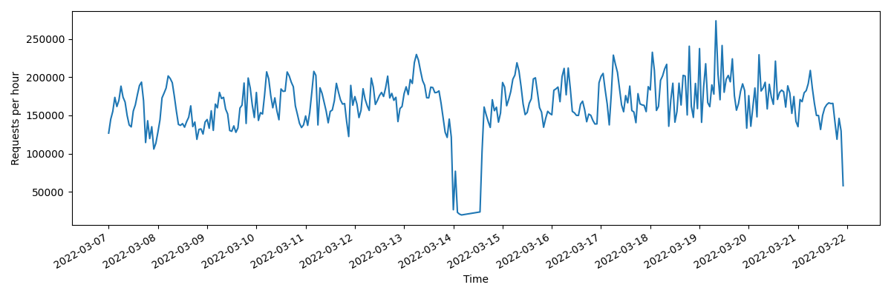

Figure 2. Successful requests over time.

In Figure 3 we break down the information shown in Figure 2 by the continent from where the request originated from. We notice that the gateway successfully processes requests originating from North America and Asia, with some requests originating from Oceania, and only very few originating from Europe and South America. Note that [ipfs.io](http://ipfs.io) (from which the gateway logs are produced from) is not the only gateway that exists. It can be the case that traffic from Europe and South America is processed by some other gateway. Or that there are no clients from Europe and South America that make requests through a gateway. This however, requires a finer analysis with complementary data, that will be performed in the future.

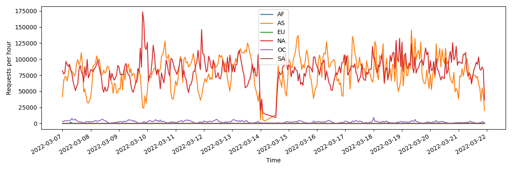

Figure 3. Successful requests over time by continent.

#### Autonomous System concentration

For completeness, we perform a brief analysis on the origin Autonomous systems of requests. In a Multi-level DHT design that groups peers based on a shared property, to understand if grouping peers by Autonomous system would be beneficial we look into the variety of Autonomous systems. A high variety of Autonomous systems will create a large number of groups with few peers. A low variety of Autonomous systems will create smaller numbers of groups with higher number of peers. From previous observations, we found that such Multi-level DHT benefits from a few groups with high numbers of peers.


Figure 4. Concentration of requests over Autonomous systems (ASes)

Figure 4 presents the concentration of requests on the y axis over the Autonomous systems on the x axis. Here we see that there are a lot of requests coming from the same Autonomous systems, which demonstrated that for most requests there is a low variability of the Autonomous system. The following table presents a summary of the top 10 Autonomous systems with most originating requests.

| ASN | ASO | Requests | Percentage |
| --- | --- | --- | --- |
| 4134 | Chinanet | 10568641 | 18.11% |
| 4837 | CHINA UNICOM China169 Backbone | 6447428 | 11.05% |
| 16509 | AMAZON-02 | 6422980 | 11,00% |
| 36321 | CSTL | 2898486 | 4.97% |
| 45102 | Alibaba US Technology Co., Ltd. | 2896238 | 4.96% |
| 7922 | COMCAST-7922 | 2414519 | 4.14% |
| 7018 | ATT-INTERNET4 | 1919163 | 3.29% |
| 14061 | DIGITALOCEAN-ASN | 1444672 | 2.47% |
| 396982 | GOOGLE-CLOUD-PLATFORM | 1013915 | 1.74% |
| 4808 | China Unicom Beijing Province Network | 970232 | 1.66% |

#### Request latency

Next we analyse the time it takes for the gateway to process the requests (i.e., request latency). Figure 5 presents an ECDF (empirical cumulative distribution function. It is empirical because it is obtained from the observed data points)  plot of the request latency (represented in the x axis of the plot, labeled request time, in seconds).  Here we see that about half of the requests made to the gateway have sub-second latency, which, although can be considered a positive result, it is still slow for most users that expect quick responses in the order of few hundreds of milliseconds.

If we look at the tail latency, we have requests that take from several minutes (> 100, < 1000 seconds) to requests that can take up to hours (> 1000, < 10,000 seconds) which are unacceptable latencies for any user.

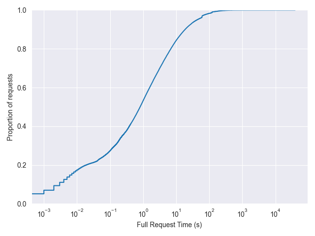

Figure 5. Request latency (time).

Latency is influenced by two main factors: network communication and content size. The IPFS gateway contains a cache, to avoid having the gateway to request every content on the IPFS network. The following table summarizes the cache status of all requests that we processed.

| Cache status | Count | Percentage |
| --- | --- | --- |
| - | 492824 | 0.844% |
| HIT | 15961623 | 27.348% |
| MISS | 41899001 | 71.788% |
| EXPIRED | 3566 | 0.006% |
| REVALIDATED | 7504 | 0.013% |

From here we see that about about 27% of all requests (with cache status HIT) were cached in the gateway at the time of the request, and about 71% of all requests (with cache status MISS) actually made requests to the IPFS network. Note that there are other cache statuses albeit at very small percentages. Nevertheless, the status EXPIRED and REVALIDATED mean that a request made to the gateway updated the cache entry. The status marked as “-”  means that the request never made it to the cache, where the request most likely failed.

In Figure 6 we plot the request latency ECDF characterized by the cache status. From here we see that requests with a cache status of MISS take more time than the rest. This is not surprising as these requests make a request to the IPFS network. However, interestingly, request that have a cache status of HIT can still take some time, which we believe is most likely due to the size of the content.


Figure 6. Request latency (time) by cache status.

Figure 7 shows the distribution of the size of the requested content (in the y axis, labeled Body Bytes, in bytes) over the request latency (in the x axis, labeled Request Time, in seconds) for requests with cache status HIT. From this figure we can see the relation between the size of the content and the latency of the request, without the effects of network communication. We see, from the top left part of the figure that the higher the content is the longer the request takes to be processed. However, we also see that there are a lot of requests that independent of the size of the requested content, still take several seconds. We believe this may be due to queuing of requests or exhaustion of resources in the gateway. However, with the data we analysed we cannot draw any conclusions, yet we suggest this should be further investigated.


Figure 7. Size of the content (Body bytes) over request latency (Request time) for requests with cache status HIT.

Figure 8 shows the distribution of the size of the requested content (in the y axis, labeled Body Bytes, in bytes) over the request latency (in the x axis, labeled Request Time, in seconds) for requests with cache status MISS. From this figure we can see the effects of network communication when processing requests. This is most noticeable on the left most part of the figure, where we see that, compared with Figure 7, requests take longer to process. An interesting thing about Figure 8 is the sudden increase in latency for content sizes of 10Kb. We do not know the reason for this, but we suspect it to be related to the size of blocks that compose the content, and the way the gateway node transfers blocks that belong to the same content.

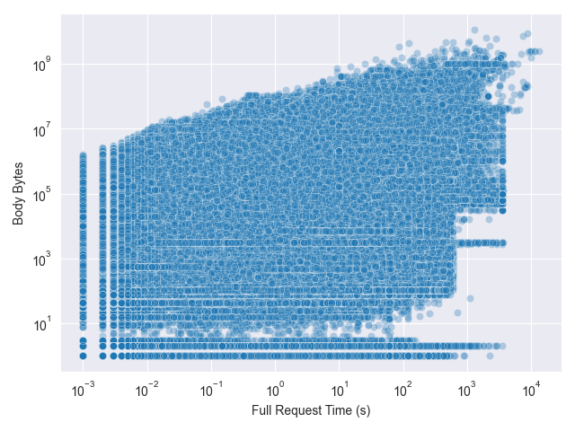

Figure 8. Size of content (Body bytes) over request latency (Request time) for requests with cache status MISS.

Lastly, one additional factor can influence network communication, which is the distance to the content provider. In Figure 9 we plot the distribution of the size of the requested content (in the y axis, labeled Body Bytes, in bytes) over the request latency (in the x axis, labeled Request Time, in seconds) for requests with cache status MISS, characterized by the continent where there is a provider for that content. Note that because content can be provided by multiple peers it multiples the number of requests over the number of providers for the requested content. To avoid plotting all the data, we choose only to present a random sample (1% of all requests served by providers in each continent) to see if there was the possibility that regions closer or farther to that of the gateway would influence the request latency.

We see from Figure 9 that there is no evident pattern related to the continent where the content is served. In a way, this is not surprising as the IPFS network is not topologically organized geographically.

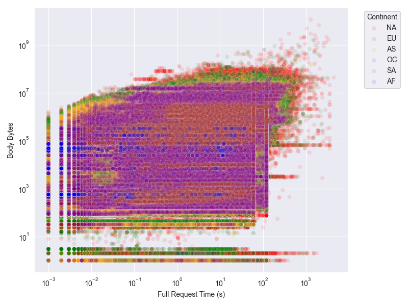

Figure 9. Size of content (Body bytes) over request latency (Request time) for requests with cache status MISS by provider continent.

In Figure 10 we show the ECDF of the request latency of request with a cache status of MISS, characterized by the continent where there is a provider for the requested content. In this figure we plot all the data, not just the sample as in the previous figure. From this figure we can see that, except from Africa (AF), present a similar distribution of request latency. The results for content provided by peers in Africa, take unexpectedly less time than the remainder regions. This can be explained by the fact that there is a lot less providers in the African regions (shown further ahead).


Figure 10. Request latency (time in seconds) for requests with cache status MISS by provider continent.

Intuitively, a Multi-level DHT design that groups nodes by their geographic region would present different results for Figures 9 and 10, showing a clear pattern where content provided by peers in the region of the DHT would yield a lower latency than requests to content provided by peers in different regions than that of the gateway. However, this depends on the access patterns of where content is requested from to where it was provided, as well as the amount of content requested. In the following we analyse the frequency of requests over each distinct CID - with this we effectively measure the popularity of CIDs.

#### Requested CIDs popularity

The popularity of all requested CIDs are depicted in Figures 11, 12, 13, and 14. Figure 11 represents the ECDF on the frequency of requests to CIDs. This shows the percentage of CIDs (in the y axis) that were requested at most a given number of times (the frequency in the x axis).

From Figure 11 we can see that almost 50% of all CIDs are only requested a single time. We can also see that a very small percentage (less than 1,5%) of CIDs were requested more than 100 times and only 17 CIDs were requested more than 100, 000 times. Figure 12 complements this by showing the actual distribution of request frequency (in the y axis) over the occurrences of CIDs (in the x axis). In particular, we can see from this figure that there is a CID that is requested about 400, 000 times (the top most left point) and there were 2, 000, 000 different CIDs that were only requested a single time (the bottom most right point). From this, we conclude that the request distribution resembles a typical Zipf distribution, where there are a few items that are very popular (i.e., are requested more often) and a large number of items that are not very popular (i.e., are requested very rarely).  

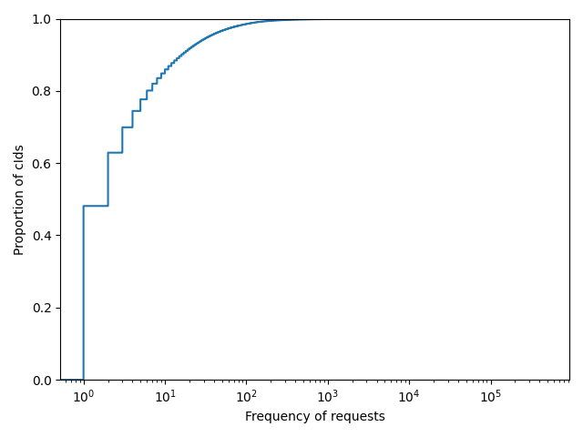

Figure 11. ECDF distribution on the frequency of requests to CIDs.

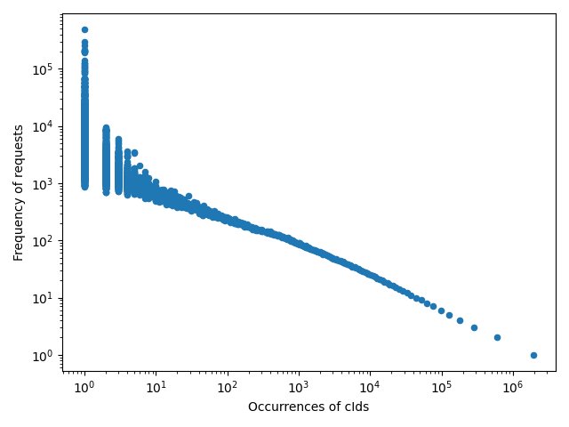

Figure 12. Distribution of frequency of requests over the occurrences of CIDs.

Figure 13 and 14 show the previous information broken down by continent. We note that requests originating from different continents follow a similar distribution shape albeit at different sizes. However, these are proportional to the amount of requests originating from each continent as seen previously in Figure 3.

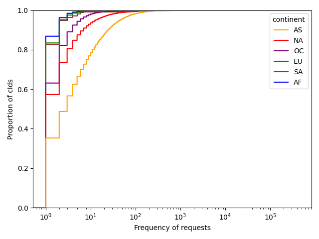

Figure 13. ECDF distribution on the frequency of requests to CIDs by continent.

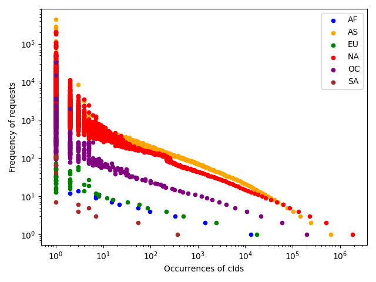

Figure 14. Distribution of frequency of requests over the occurrences of CIDs by continent.

Note that, after some inspection of the raw dataset, that the requests made to the top requested CIDs were not all resolved locally by the gateway (i.e., were not in the gateway’s cache). In fact, the data suggests that about half of the requests made to the top requested CIDs were in cache at the time of the request. Which either suggests that the gateway’s cache has a small time-to-live for objects, or has an eviction policy that does not match its workload. From the data gathered by our measurement architecture it is possible to reconstruct the state of the cache. By doing so, it would be possible to further investigate this. Nevertheless, this is outside of the scope of this report, and is planned for future work.

For a Multi-level DHT design that groups nodes according to their geographic region, these results suggest that there will be regions that will generate more traffic than others, albeit, most of the requests will target the same CIDs. In the next section we analyse the data we gathered about providers of content, to understand how content is distributed among providers.

### Providers

For the providers data, we begin by analysing the geo-distribution of providers. This is shown in the following table.

|  | Africa (AF) | Asia (AS) | Europe (EU) | North America (NA) | Oceania (OC) | South America (SA) | Antartica (AN) | Relayed (Rl) | Unknown (Un) |
| --- | --- | --- | --- | --- | --- | --- | --- | --- | --- |
| Number of Providers | 40 | 4, 959 | 5, 789 | 10, 983 | 431 | 104 | 1 | 2, 473 | 689 |

We can see here that North America has the largest partition of providers with 10, 983 distinct providers. This is followed by Europe and Asia that have each about half the providers located in North America. Oceania, South America, and Africa, have far less providers. Interestingly, we found a provider in Antartica, that showed up due to a single request performed from North America. Here we also present the providers that were behind a relay node (labeled as Relayed), as well as providers whose location was not known (i.e., did not match with any entry on the MaxMind database). From this point on, we treat peers behind relay nodes as peers with unknown location.

From the viewpoint of a Multi-level DHT design, the table above suggests that splitting the DHT to multiple rings, where a DHT ring is assigned to each region, is sub-optimal, as it would create groups with very high variance among them. Another option here, would be to group peers in two groups: peers from North America, and peers from the remaining regions. This will create 2 groups with an approximately equal count of peers. However, it would be best to have a higher number of groups to further divide the DHT in smaller more efficient regions.

#### Autonomous Systems concentration

Another way to group peers, would be to use the Autonomous system of the peers. Here we analyse the concentration of providers over different Autonomous systems.


Figure 15. Concentration of providers over Autonomous systems (ASes).

This is shown in Figure 15, where the concentration of providers is on the y axis and number of Autonomous systems is on the x axis. Here we see that there are a lot of providers located in the same Autonomous systems, which suggests that the Autonomous system could be used to further divide the Multi-level DHT regions. The following table presents a summary of the top 10 Autonomous systems with most providers.

| ASN | ASO | Count | Percentage |
| --- | --- | --- | --- |
| 20473 | AS-CHOOPA | 5053 | 17,87% |
| 16509 | AMAZON-02 | 2221 | 10,57% |
| 51167 | Contabo GmbH | 1437 | 7,85% |
| 14061 | DIGITALOCEAN-ASN | 1354 | 5,08% |
| 14618 | AMAZON-AES | 1002 | 4,79% |
| 8100 | ASN-QUADRANET-GLOBAL | 899 | 3,54% |
| 7922 | COMCAST-7922 | 700 | 3,18% |
| 24940 | Hetzner Online GmbH | 674 | 2,47% |
| 4766 | Korea Telecom | 582 | 2,38% |
| 40021 | CONTABO | 520 | 2,06% |

In the following we analyse the distribution of CIDs over providers. In more detail in Figures 16 and 17 we analyse the amount of different providers that each requested CID has (i.e., the amount of replicas each CID has). In Figures 18 and 19 we analyse the CIDs each provider provides.

#### Distribution of CIDs over different Providers

Figure 16 shows an ECDF distribution on the percentage of CIDs (in the y axis) that have at most a given amount of different providers (in the x axis). We can see here that a bit more than 40% of CIDs only have single provider and that only a small percentage of CIDs have more than 10 different providers. This shows that in IPFS (for the particular dataset from the gateway) most content items have only a select few providers. Figure 17 breaks this information by continent, where we can see that CIDs provided by providers in Africa and North America have more distinct providers in that region. However, this can be simply due to the fact that these represent the largest and smallest partition respectively.  


Figure 16. ECDF distribution of CIDs provided by different peers (CID replicas).


Figure 17. ECDF distribution of CIDs provided by different peers (CID replicas) by continent.

#### Distribution of CIDs per Provider

Figure 18 shows the ECDF for the percentage of providers (in the y axis) that provided at most a given number of distinct CIDs (in the x axis). From this, we can see that almost 60% of providers only provide a single CID, and that less than 5% of providers provide more than 100 different CIDs. This shows that there are a select few providers that provided most of the requested content.

Figure 19 breaks down this information by continent. Here we can see the providers that provide more CIDs are located in North America and in Europe.

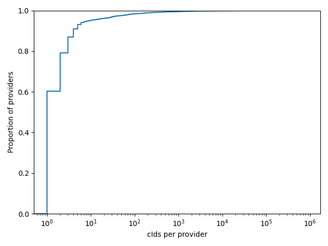

Figure 18. ECDF distribution of CIDs per Provider.


Figure 19. ECDF distribution of CIDs per Provider by continent.

It is also important to note that, unlike what it would be expected, the top most requested content is not the top most provided content. This comes from a careful analysis of the gathered data, and in fact, the top most requested content (i.e., the 17 CIDs that are requested more than 100, 000 times) is only provided by less than 10 providers. However, there are some exceptions to this, with one of the CIDs being provided by 4, 663 different providers. Note that this CID is one of the first CID with more than 100, 000 requests, having been requested 112, 779 times. On the other hand, the most requested CID was requested 482, 620 and is only provided by a single provider. This discrepancy can be due to 2 factors. The first is the content type. While the most requested CID is content related to NFTs, the CIDs with 4, 663 providers is content related to [Gala Games](https://app.gala.games/). The second factor, can be because this content is requested through a gateway where clients do not have the ability to reprovide content.

For the Multi-level DHT these results suggest that content is somewhat evenly distributed by the proportion of peers in each geographical region, which indicates that groups in the Multi-level DHT can have some variance in size, has the content provided by each region is proportional to the size of the region.

In the following we present the last results from our study, where we join the requests and providers data.  

### Requested content vs. Provided content

Here we analyse the requests and providers data together. To this end, we matched the location of the origin of the requests with the location of providers that provided the requested CID. Due to the discrepancy on number of requests and providers by each continent, we normalised the mapped values by the total number of requests originating from each continent. Figure 20 shows the resulting heatmap from this data. The y axis of the heatmap represents the location of the origin of requests while on X axis the location of providers. Each cell represents the percentage of requests originating from a given continent that had a provider located in another (or the same) continent.

From the heatmap, we can see that most requests have providers mostly in North America and Europe. This is not surprising from the previously observed data, where North America and Europe have the largest portion of providers that provided the requested content. The data shown in this heatmap suggests that there is very little to no geo-location interest in the requested content, as there is no “heat” visible in the ascending diagonal of the plot (which would indicate that most requests had providers in their own originating continent).


Figure 20. Locality heatmap. Maps request origin location to the provider location of each requested CID. The values are normalised by the total number of requests originated by from continent.

This is a very enlightening result for a Multi-level DHT designs that tries to group peers based on their geo-location, as having a dedicated DHT for each continent will not be beneficial given this workload. An alternative could be to have only dedicated DHTs for peers located in Europe and North America, having a global DHT for the remainder of nodes, with bridge mechanisms among each dedicated DHT. This design would divide the routing effort among the 3 dedicated DHTs possibly improving lookup times.

To conclude our analysis, we present in Figure 21 the distribution of requests originating from the top 10 Autonomous systems with higher amounts of originating requests over the Autonomous system that contained the most providers that provided a requested content.

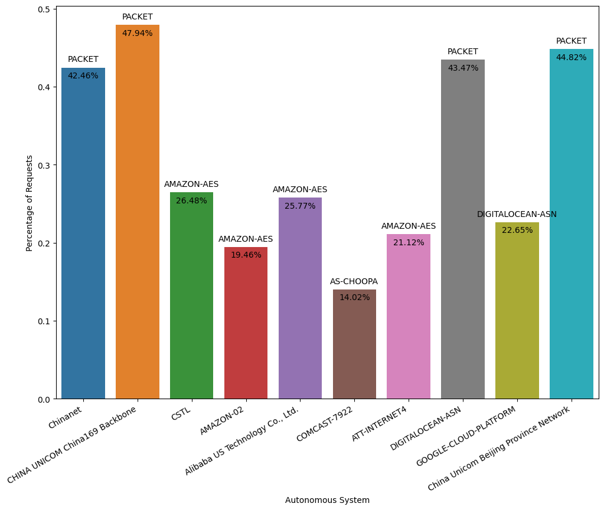

Figure 21. Percentage of requests originating from ASes to AS with highest percentage of providers of requested content.

From this figure, we can draw the same conclusion as per the analysis on the heatmap, where we can see that most requests are to content provided in providers located within the PACKET (ASN: 54825), AMAZON-AES (ASN: 14618), AS-CHOOPA (ASN: 20473), and DIGITALOCEAN-ASN (ASN: 14061) Autonomous systems, which are not the ASes from where the requests originated from. This suggests, once again, that there is very little interest in locality (i.e., requests originating from one AS are not served within the same AS).

## Conclusion

IPFS is a very large network with a substantial amount of traffic. With this work we aimed at analysing the locality of interest of requested content in IPFS to guide and motivate Multi-level DHT designs that can improve the network’s performance. To this end, we have built a measurement architecture and methodology that allows to gather metrics on the location of requesters and providers of content. With this measurement software we analysed the traffic processed by one of the most popular IPFS gateways — [ipfs.io](http://ipfs.io).

After a careful analysis of the gathered data, we discovered that content requested through the IPFS gateway is concentrated in a few distinct CIDs (requests to the 17 - 0,001 % - most popular CIDs correspond to 5,4% of all requests) that are provided by a select few providers (253 - 0,9% -  providers without considering the CID with 4, 663 - 17% - providers). We further analysed the location of the origin of requests as well as the location of the providers of the requested CIDs, and concluded that currently there is no correlation between the two, with most requests having providers in North America and Europe.

These results suggest that the current DHT can be suboptimal as most requests are concentrated over a select few number of providers, which means that resolving this content on the DHT means routing over mostly the same peers. Instead, a Multi-level DHT design that could diversify the routing paths could be of interest as to promote the balance on the routing effort. Alternatively, our results also suggest a Multi-level DHT design that would group peers by application or content type rather than geo-location or AS could be of interest as the number of providers and interested clients differs based on application and content type, possibly allowing for higher diversity of routing paths.

This report presents very interesting insights on the workload that IPFS is subjected to via one of the most popular gateways. Nevertheless, as our analysis suggests that the routing task is only shared by a few nodes on the DHT, it should be complemented with other performance analysis to understand the impact of these findings.
